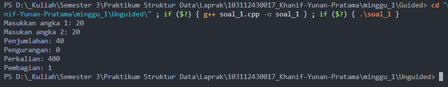
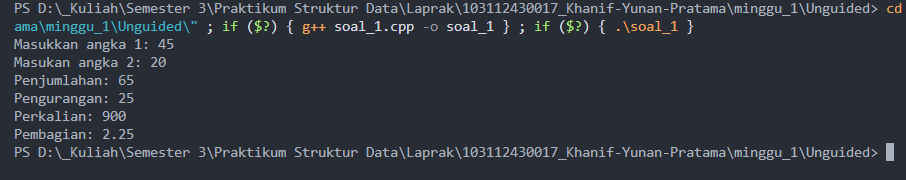
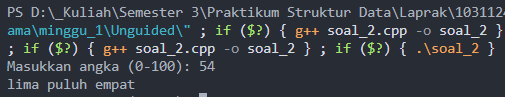
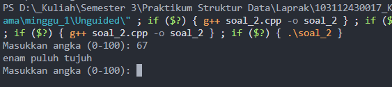
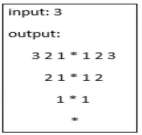
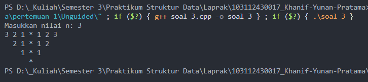

	# <h1 align="center">Laporan Praktikum Modul 1 - Codeblocks IDE & Pengenalan Bahas C++ (Bagian Pertama)</h1>
<p align="center">Khanif Yunan Pratama - 103112430017</p>

## Dasar Teori
Bahasa tingkat tinggi adalah bahasa pemrograman yang beorientasi pada bahasa manusia dan dirancang agar lebih mudah dipahami, biasanya menggunakan beberapa kata dari bahasa Inggris seperti IF, AND, dan sebagainya. Bahasa C++ termasuk ke dalam kelompok bahasa tingkat tinggi[1].  Berikut ini penjelasan mengenai beberapa algoritma dalam bahasa C++:

### A. Input dan Output<br/>
Input dan output merupakan suatu kriteria dasar pada pemrograman. Input adalah suatu algoritma yang dapat memiliki nilai 0 atau lebih dari masukan, sedangkan output wajib memiliki satu atau lebih keluaran, karena suatu algoritma yang tidak menghasilkan keluaran dapat dikatakan sebagai algoritma yang tidak perlu dilakukan[2]. Pada dasarnya, sebuah program biasanya terdiri dari 2 hal ini, input dan output. Jadi input akan menerima masukan dari pengguna, sedangkan output akan menampilkan hasil kepada pengguna. Dalam bahasa C++, input menggunakan perintah cin(C IN) yang bisa berarti masuk dan untuk output menggunakan perintah cout(C OUT) yang berarti keluar/keluaran dari suatu program.
### B. Operator[2]
#### 1. Operator Aritmatika
Operator aritmatika yang digunakan kurang lebih sama seperti bahasa pemrograman lain, yaitu:

| Operator | Arti            |
| -------- | --------------- |
| +        | Penjumlahan     |
| -        | Pengurangan     |
| *        | Perkalian       |
| /        | Pembagian       |
| ^        | Perpangkatan    |
| DIV      | Pembagian Bulat |
| MOD      | Sisa Bagi       |
| ABS      | Harga Mutlak    |
#### 2. Operator Perbandingan
Operator perbandingan berfungsi untuk membandingkan

| Operator | Arti                         |
| -------- | ---------------------------- |
| =        | Sama dengan                  |
| <        | Lebih kecil                  |
| >        | Lebih besar                  |
| <=       | Lebih kecil atau sama dengan |
| >=       | Lebih besar atau sama dengan |
| <>       | Tidak sama dengan            |
#### 3. Operator Logika
Operator logika digunakan untuk operasi logika. Operator ini akan menghasilkan nilai True atau False.

| Operator | Arti                                                   |
| -------- | ------------------------------------------------------ |
| AND      | Dan (Bernilai benar ketika keduanya bernilai benar)    |
| OR       | Atau (Bernilai benar ketika salah satu bernilai benar) |
| NOT      | Tidak (Jika benar maka salah, jika salah maka benar)   |

#### 4. Percabangan
Percabangan merupakan baris kode yang akan memeriksa terlebih dahulu apakah bernilai True, atau false kemudian akan menghasilkan output tertentu tergantung dari hasil tersebut. Pada percabangan terjadi pemeriksaan kondisi secara urut dan menghasilkan output sesuai kondisi[4].

```c++
    if (angka1 == angka2) {
        cout << angka1 << " sama dengan " << angka2 << endl; 
    } else if (angka1 < angka2) {
        cout << angka1 << " lebih kecil dari " << angka2 << endl;
    } else if (angka1 > angka2) {
        cout << angka1 << " lebih besar dari " << angka2 << endl;
    }
```

#### 5. Perulangan
Perulangan digunakan untuk mengulangi beberapa baris kode hingga kondisi terpenuhi[5]. Dengan perulangan, maka baris kode akan lebih terstruktur dan ringkas, karena tidak perlu mengulangi perintah yang ingin ditampilkan berulang. Terdapat beberapa perulangan, ada for, while dan do while. 
```c++
for (int i = 0; i < angka; i++) {
        cout << i << " - ";
    }

    cout << endl;

    int j = 10;
    while (j > angka) {
        cout << j << " - ";
        j--;
    }

    cout << endl;

    int k = 10;
    do {
        cout << k << " - ";
    } while (k < angka);

    return 0;
```

#### 6. Switch Case
Hampir sama dengan percabangan, bedanya switch case tidak menghasilkan nilai true atau false. Switch case biasanya dipakai untuk memilih opsi. Semisal dalam menu program aritmatika, memungkinkan pengguna untuk memilih operasi yang akan dijalankan, bisa menggunakan switch case.
```c++
switch(pilihan) {
    case 1:
        cout << "Hasil dari penjumlahan: " << angka1 << "+" << angka2 << "=" << angka1 + angka2 << endl;
        break;
    case 2:
        cout << "Hasil dari pengurangan: " << angka1 << "-" << angka2 << "=" << angka1 - angka2 << endl;
        break;
    case 3:
        cout << "Hasil dari perkalian: " << angka1 << "*" << angka2 << "=" << angka1 * angka2 << endl;
        break;
    case 4:
        cout << "Hasil dari pembagian: " << angka1 << "/" << angka2 << "=" << angka1 / angka2 << endl;
        break;
    default:
        cout << "Pilihan tidak ditemukan" << endl;
}
```

#### 7. Struct
Dalam bahasa pemrograman C++, struct merupakan struktur data yang memungkinkan terjadi pembentukan tipe data baru dengan menggabungkan berbagai macam variabel dengan tipe data yang berbeda[3]. Penggunaan struct akan memudahkan dalam pemetaan entitas dan membuat lebih terstruktur.
```c++
struct rapot{
        string nama;
        float nilai;
};
```

## Guided 

### 1. Input Output

```C++
#include<iostream>
using namespace std;

int main() {
    int angka1, angka2;
    cout << "Masukkan angka 1: ";
    cin >> angka1;
    
    cout << "Masukan angka 2: ";
    cin >> angka2;
    
    cout << "Penjumlahan: " << angka1 + angka2 << endl;
    cout << "Pengurangan: " << angka1 - angka2 << endl;
    cout << "Perkalian: " << angka1 * angka2 << endl;
    cout << "Pembagian: " << angka1 / angka2 << endl;
    cout << "Sisa bagi: " << angka1 % angka2 << endl;

    return 0;   
}
```
Program ini akan berjalan dan meminta untuk memasukan dua buah inputan bertipekan integer, yang kemudian dua inputan tersebut akan diproses dengan beberapa operasi aritmatika, yaitu penjumlahan, pengurangan, perkalian, pembagian, dan modulus/sisa bagi. Hasil atau output yang ditampikan adalah hasil dari beberapa operasi aritmatika tersebut.

### 2. Percabangan

```C++
#include<iostream>
using namespace std;

int main () {
    int angka1, angka2;
    cout << "Masukkan angka 1: ";
    cin >> angka1;
    
    cout << "Masukan angka 2: ";
    cin >> angka2;

    if (angka1 == angka2) {
        cout << angka1 << " sama dengan " << angka2 << endl; 
    } else if (angka1 < angka2) {
        cout << angka1 << " lebih kecil dari " << angka2 << endl;
    } else if (angka1 > angka2) {
        cout << angka1 << " lebih besar dari " << angka2 << endl;
    }

    int pilihan;
    cout << "\nMenu Artimatika" << endl;
    cout << "1. Penjumlahan" << endl;
    cout << "2. Pengurangan" << endl;
    cout << "3. Perkalian" << endl;
    cout << "4. Pembagian" << endl;
    cout << "Masukan pilihan (1/2/3):";
    cin >> pilihan;

    switch(pilihan) {
        case 1:
            cout << "Hasil dari penjumlahan: " << angka1 << "+" << angka2 << "=" << angka1 + angka2 << endl;
            break;
        case 2:
            cout << "Hasil dari pengurangan: " << angka1 << "-" << angka2 << "=" << angka1 - angka2 << endl;
            break;
        case 3:
            cout << "Hasil dari perkalian: " << angka1 << "*" << angka2 << "=" << angka1 * angka2 << endl;
            break;
        case 4:
            cout << "Hasil dari pembagian: " << angka1 << "/" << angka2 << "=" << angka1 / angka2 << endl;
            break;
        default:
            cout << "Pilihan tidak ditemukan" << endl;
    }
    
    return 0;
}
```
Program ini sebenernya hampir sama seperti program sebelumnya, yaitu program meminta untuk memasukan dua buah inputan bertipekan integer. Bedanya adalah di dalam pemrosesan nya, program ini menggunakan percabangan dan switch case. 

Yang pertama adalah percabangan, percabangan disini akan di eksekusi terlebih dahulu. Angka pertama dan kedua akan dibandingkan, apakah angka satu sama dengan angka dua, angka satu lebih besar dari angka dua atau sebaliknya angka satu lebih kecil dari angka dua. Output yang dihasilkan adalah hasil perbandingan tersebut.

Setelah percabangan selesai, akan ditampilkan beberapa menu, yang kemudian diminta untuk memasukan sebuah inputan sesuai menu yang tersedia. Pilihan menu yang tersedia adalah operasi aritmatika. Program akan mengeksekusi angka satu dan angka dua sebelumnya, sesuai dengan perintah. Semisal kita memilih opsi penjumlahan, maka program akan menjumlahkan angka satu dan angka dua. Begitu juga ketika memilih operasi aritmatika yang lain, dan akan menampilkan outputnya.

### 3. Perulangan

```C++
#include<iostream>
using namespace std;

int main() {
    int angka;
    cout << "Masukan angka : ";
    cin >> angka;

    for (int i = 0; i < angka; i++) {
        cout << i << " - ";
    }

    cout << endl;

    int j = 10;
    while (j > angka) {
        cout << j << " - ";
        j--;
    }

    cout << endl;

    int k = 10;
    do {
        cout << k << " - ";
    } while (k < angka);

    return 0;
}
```
Program ini berisikan 3 jenis perulangan yang berbeda, yaitu for, while dan do while. Ketika program berjalan, program meminta untuk memasukan inputan bertipekan integer. Kemudian angka yang dimasukan akan di proses, mulai dari for, kemudian while dan terakhir do while.

For akan melakukan perulangan, yaitu dimulai dari 0 karena i di definisikan sebagai 0, dan berakhir sebelum angka yang dimasukan sebelumnya. Jadi for akan menampilkan angka urut yang dipisahkan oleh "-". Semisal inputan angka di awal adalah 5, maka output dari for adalah 0-1-2-3-4-.

While akan melakukan perulangan dimulai dari nilai 10 karena variabel j didefinisikan dengan 10, dan perulangan terus berjalan selama nilai j lebih besar dari angka yang dimasukkan sebelumnya. Pada setiap perulangan, nilai j ditampilkan lalu dikurangi 1. Jadi while akan menampilkan angka menurun yang dipisahkan oleh "-". Semisal inputan angka di awal adalah 5, maka output dari while adalah 10-9-8-7-6-.

Pada do while, terdapat variabel k yang menampung nilai  10. Do while akan selalu menampilkan output 10. Kemudian akan di cek, apakah angka yang dimasukan lebih dari 10 atau kurang dari 10. Jika angka yang dimasukan kurang dari 10, do while ini hanya akan menampilkan output 10. Kalau angka yang dimasukan lebih dari 10, maka perulangan akan terus berjalan menampilkan angka 10 secara terus menerus. Hal ini terjadi karena while (k < angka) bernilai true terus. 

### 4. Struck

```C++
#include<iostream>
using namespace std;

int main() {
    const int MAX = 3;
    struct rapot{
        string nama;
        float nilai;
    };
    
    rapot siswa[MAX];

    for(int i = 0 ; i < MAX; i++){
        cout << "Masukan nama siswa: ";
        cin >> siswa[i].nama;
        cout << "Masukan nilai siswa: ";
        cin >> siswa[i].nilai;
        cout << endl;
    }

    int j = 0;
    while (j < MAX) {
        cout << "Nama siswa: " << siswa[j].nama << ", Nilai: " << siswa[j].nilai << endl;
        j++;
    }
    return 0;
}
```
Program ini menggunakan struck, array, for, dan while. Pertama terdapat nilai konstanta yaitu integer dengan nilai 3. Kemudian terdapat struck yang isinya adalah nama untuk menampung nama siswa bertipe string, dan nilai bertipe integer untuk menampung nilai dari siswa tersebut. Kemudian ada array yang panjang array nya adalah sesuai dengan nilai konstanta yang udah di tentuin sebelumnya.

Kemudian akan berjalan sebuah perulangan untuk memasukan inputan nama dan nilai. Perulangan di mulai dari 0 sampai nilai konstanta MAX. Inputan yang pertama muncul adalah inputan nama, kemudian di ikuti dengan nilai. Inputan yang dimasukan akan

Terus yang terakhir ada while yang akan menampilkan semua inputan atau isi array diatas. While di definisikan yaitu menggunakan j yang bernilai 0 dan j < MAX. Jika nilai j sudah lebih dari max, maka akan berhenti. Yang di tampilkan oleh while ini adalah nama siswa beserta dengan nilai nya yang sudah dimasukan tadi.

## Unguided 

### 1. Buatlah program yang menerima input-an dua buah bilangan betipe float, kemudian memberikan output-an hasil penjumlahan, pengurangan, perkalian, dan pembagian dari dua bilangan tersebut.

```C++
#include<iostream>
using namespace std;

int main() {
    const int MAX = 3;
    struct rapot{
        string nama;
        float nilai;
    };
    
    rapot siswa[MAX];

    for(int i = 0 ; i < MAX; i++){
        cout << "Masukan nama siswa: ";
        cin >> siswa[i].nama;
        cout << "Masukan nilai siswa: ";
        cin >> siswa[i].nilai;
        cout << endl;
    }

    int j = 0;
    while (j < MAX) {
        cout << "Nama siswa: " << siswa[j].nama << ", Nilai: " << siswa[j].nilai << endl;
        j++;
    }
    return 0;
}
```
### Output Unguided 1 :

##### Output 1

##### Output 2


Program ini akan berjalan dan meminta untuk memasukan dua buah inputan bertipekan float, yang kemudian dua inputan tersebut akan diproses dengan beberapa operasi aritmatika, yaitu penjumlahan, pengurangan, perkalian, dan pembagian. Hasil atau output yang ditampikan adalah hasil dari beberapa operasi aritmatika tersebut.

### 2. Buatlah sebuah program yang menerima masukan angka dan mengeluarkan output nilai angka tersebut dalam bentuk tulisan. Angka yang akan di- input-kan user adalah bilangan bulat positif mulai dari 0 s.d 100

```C++
#include <iostream>
#include <string>
using namespace std;

int main() {
    int angka;
    cout << "Masukkan angka (0-100): ";
    cin >> angka;

    string satuan[] = {"nol", "satu", "dua", "tiga", "empat", "lima", "enam", "tujuh", "delapan", "sembilan"};
    string puluhan[] = {"sepuluh", "sebelas", "dua belas", "tiga belas", "empat belas", "lima belas", "enam belas", "tujuh belas", "delapan belas", "sembilan belas"};
    string puluhanKata[] = {"", "", "dua puluh", "tiga puluh", "empat puluh", "lima puluh", "enam puluh", "tujuh puluh", "delapan puluh", "sembilan puluh"};

    if (angka >= 0 && angka <= 9) {
        cout << satuan[angka] << endl;
    }
    else if (angka >= 10 && angka <= 19) {
        cout << puluhan[angka - 10] << endl;
    }
    else if (angka >= 20 && angka <= 99) {
        int puluh = angka / 10;
        int satu = angka % 10;
        if (satu == 0) cout << puluhanKata[puluh] << endl;
        else cout << puluhanKata[puluh] << " " << satuan[satu] << endl;
    }
    else if (angka == 100) {
        cout << angka << " seratus" << endl;
    }
    else {
        cout << "Invalid, inputan harus di antara 0-100" << endl;
    }

    return 0;
}
```
### Output Unguided 2 :

##### Output 1

##### Output 2

Program ini bertujuan untuk konversi dari angka ke huruf alias pengucapan dari angka yang dimasukan. Semisal memasukan inputan 20 maka outputnya dua puluh. Tersimpan rapi sebuah array yang terbagi dari satuan, puluhan dan angka puluhan. Array ini dibuat untuk menyimpan data-data pengucapan angka.

### 3. Buatlah program yang dapat memberikan input dan output sbb.


```C++
#include <iostream>
using namespace std;

int main() {
    int n;
    cout << "Masukkan nilai n: ";
    cin >> n;

    for (int i = n; i >= 1; i--) {
        for (int spasi = 0; spasi < n - i; spasi++) {
            cout << "  ";
        }
        for (int j = i; j >= 1; j--) {
            cout << j << " ";
        }
        cout << "* ";
        for (int j = 1; j <= i; j++) {
            cout << j << " ";
        }
        cout << endl;
    }

    for (int spasi = 0; spasi < n; spasi++) {
        cout << "  ";
    }
    cout << "*" << endl;

    return 0;
}
```
### Output Unguided 3 :

Program ini berisikan beberapa perulangan yang mengatur agar membentuk sebuah pola segitiga terbalik dengan sisi kanan kiri adalah angka dan tengah dipisahkan dengan bintang. 
## Kesimpulan
Pada modul ini mengajarkan pengenalan dasar dari Bahasa Pemrograman C++. Mulai dari input, output, percabangan, perulangan, struct dan operasi dasar lainnya. Pastinya operasi dasar ini akan sangat berguna untuk kedepannya.
## Referensi
[1] Dewi, Luh Joni Erawati. (2010). "MEDIA PEMBELAJARAN BAHASA PEMROGRAMAN C++". Jurusan Manajemen Informatika, FTK, Undiksha. Diakses pada 27 September 2025 melalui https://ejournal.undiksha.ac.id/index.php/JPTK/article/download/31/25.
<br>[2] Hanief, Shofwan., Jepriana, I Wayan. (2020). "KONSEP ALGORITME DAN APLIKASINYA DALAM BAHASA PEMROGRAMAN C++". Diakses pada 28 September 2025 melalui https://books.google.co.id/books?id=BRQQEAAAQBAJ&lpg=PP1&ots=0DeP3BBTlU&dq=perulangan%20c%2B%2B&lr&hl=id&pg=PP1#v=onepage&q=perulangan%20c++&f=false.
<br>[3] Putra, Muhammad Taufik Dwi., Munawir., Yuniarti, Ana Rahma. (2023). "BELAJAR PEMROGRAMAN LANJUT DENGAN C++". Diakses pada 28 September 2025 melalui https://repository.penerbitwidina.com/publications/564507/belajar-pemrograman-lanjut-dengan-c.
<br>[4] Indahyati, Uce., Rahmawati Yunianita. (2020). "BUKU AJAR ALGORITMA DAN PEMROGRAMAN DALAM BAHASA C++". Sidoarjo: Umsida Press. Diakses pada 28 September 2025 melalui https://press.umsida.ac.id/index.php/umsidapress/article/download/978-623-6833-67-4/759/5250.
<br>[5] Akbar, Bayu. (2022). "PERULANGAN C++". Diakses pada 28 September 2025 melalui https://blog.rumahcoding.co.id/perulangan-c/.
