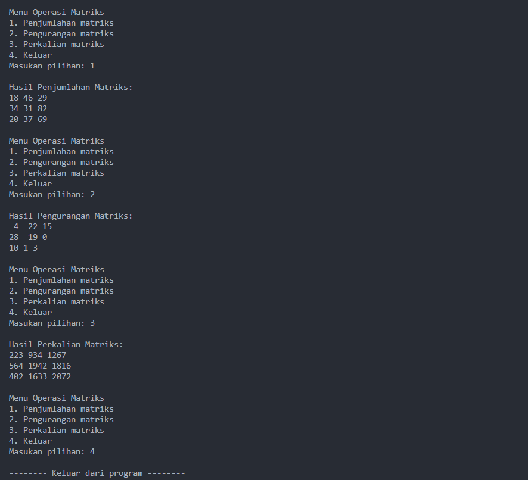
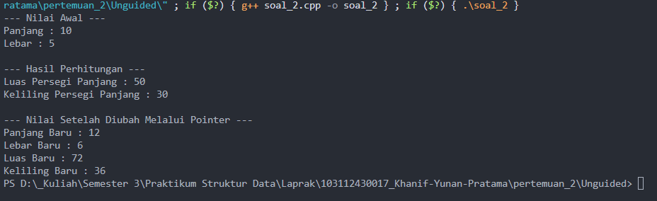

# <h1 align="center">Laporan Praktikum Modul 2 - Pengenalan Bahas C++ (Bagian Kedua)</h1>
<p align="center">Khanif Yunan Pratama - 103112430017</p>

## Dasar Teori
Materi yang selanjutnya dibahas mengenai beberapa point, seperti array, pointer, fungsi, dan prosedur. 

## 1. Array
Array merupakan sebuah tipe data bentukan yang terstruktur dari sejumlah komponen dengan tipe data yang sama[1]. Jadi bisa dibilang array merupakan sebuah kumpulan data yang disusun menjadi satu kesatuan. Jumlah komponen pada array ditandai dengan index, yang biasanya dimulai dari 0 hingga panjang array. Array dibedakan menjadi beberapa, yaitu:
#### a. Array Satu Dimensi
Array satu dimensi merupakan array yang hanya memiliki data tunggal seperti angka tunggal, karakter tunggal, dan sebagainya[2]. Ibaratnya adalah sebuah rak buku, yang isinya kumpulan buku buku yang disusun secara rapi dari buku 1 hingga buku terakhir. 
#### b. Array Dua Dimensi
Array dua dimensi adalah suatu kumpulan data terstruktur yang terdiri dari dua dimensi atau dua indeks, yaitu baris dan kolom[3]. Ibaratkan sebagai rak lemari yang berisikan kolom dan baris. Dalam setiap baris dan kolom berisi data data yang saling berkaitan.

## 2. Pointer
Pointer adalah sebuah variabel yang berisikan alamat memori (bukan nilai) atau dengan kata lain dapat dikatakan bahwa pointer adalah suatu variabel penunjuk ke lamat memori tertentu. Cara pendeklarasian pointer dalam bahasa C adalah dengan menambakan tanda asterisk (bintang) didepan nama pointer[4]. 
#### a. Operator & (Operator Diference)
Operator deference (&) yaitu mendeklarasikan suatu variabel didalam penggantian memori. Operator ini biasa disebut dengan “address of”[4].
#### b. Operator * (Operator Reference)
Operator Reference (bintang) yaitu dapat mengakses secara langsung nilai yang terdapat didalam variabel yang berpointer, hal ini dapat dilakukan dengan menambahkan identifier asterisk (). Operator ini biasa disebut dengan “value pointed by”[4].

# 3. Fungsi dan Prosedur[5]
Fungsi dan prosedur memiliki kemiripan yang bisa dibilang sangat mirip. Namun terdapat beberapa perbedaan yang bisa dilihat untuk membedakan antara fungsi dan prosedur dalam pemrograman.  Salah satu kesamaan nya adalah membuat program lebih terstruktur, rapi, dan pastinya akan lebih mudah untuk dibaca.
#### a. Fungsi
Fungsi merupakan sub dari sebuah program yang bisa digunakan kembali baik di dalam program itu sendiri, maupun di program lain. Fungsi dapat menerima output dan menghasilkan sebuah output. Fungsi biasanya akan mengembalikan sebuah nilai dari hasil proses yang berjalan dalam sebuah fungsi.
#### b. Prosedur
Hampir sama dengan fungsi, bedanya prosedur tidak mengembalikan nilai. Fungsinya sama seperti fungsi yaitu membungkus program agar lebih rapi dan terstruktur. Biasanya prosedur digunakan untuk program yang tidak memerlukan pengembalian nilai, seperti menampilkan menu, menyimpan data ke file dan sebagainya.
## Guided 

### 1. Array 1 Dimensi

```C++
#include<iostream>
using namespace std;

int main() {
    int arr[5];

    for (int i = 0; i < 5; i++) {
        cout << "Masukan value index ke-" << i << ": ";
        cin >> arr[i];
    }

    int j = 0;
    while (j < 5) {
        cout << "Isi index ke-" << j << ": " << arr[j] << endl;
        j++;
    }

    return 0;
}
```
Program diatas merupakan contoh penggunaan array 1 dimensi. Array dalam program diatas bertipekan integer, dan menyimpan 5 elemen array (dengan index 0,1,2,3,4). Ketika program berjalan, program akan meminta untuk dimasukan sebuah angka bebas. Program akan meminta inputan sebanyak elemen yang telah di tetapkan pada array, yaitu 5. Hal ini ditandai dari perulangan pertama yang digunakan untuk mengulangi perintah inputan sebanyak 5 kali. Kemudain yang terakhir adalah perulangan yaitu menggunakan while, yang dimana perulangan ini akan menampilkan semua elemen isi array yang sudah dimasukan sebelumnya, secara urut berdasarkan index. 
### 2. Array 2 Dimensi

```C++
#include<iostream>
using namespace std;

void tampilkanHasil(int arr[2][2]){
    for (int i = 0; i < 2; i++) {
        for (int j = 0; j < 2; j++) {
            cout << arr[i][j] << " ";
        }
        cout << endl;
    }
}

int main() {
    int arrA[2][2] = {
        {1,2},
        {3,4}
    };
    int arrB[2][2] = {
        {2,3},
        {4,5}
    };

    int arrC[2][2] = {0};
    int arrD[2][2] = {0};

    for(int i = 0; i < 2; i++){
        for(int j = 0; j < 2; j++){
            arrC[i][j] = arrA[i][j] + arrB[i][j];
        }
    }

    cout << "Hasil penjumlahan: " << endl;
    tampilkanHasil(arrC);

    cout << endl;

    for(int i = 0; i<2; i++){
        for(int j = 0; j<2; j++){
            for (int k = 0; k<2; k++){
                arrD[i][j] += arrA[i][k] * arrB[k][j];
            }
        }
    }

    cout << "Hasil perkalian: " << endl;
    tampilkanHasil(arrD);

}
```
Program di atas merupakan contoh penggunaan array dua dimensi dengan ukuran 2x2. Array dalam program ini bertipe integer dan digunakan untuk menyimpan nilai matriks arrA dan arrB. Ketika program dijalankan, dua array sudah memiliki nilai awal. Program akan melakukan operasi penjumlahan matriks menggunakan perulangan for untuk menjumlahkan setiap elemen pada posisi yang sama, dan hasilnya disimpan di array arrC. Kemudian, hasil penjumlahan akan ditampilkan. Selanjutnya, program juga melakukan perkalian matriks dengan beberapa perulangan bersarang untuk menghitung hasil kali antar elemen matriks, yang hasilnya disimpan di array arrD dan juga ditampilkan. Dengan demikian, program ini memperlihatkan cara kerja dasar operasi penjumlahan dan perkalian pada array dua dimensi.
### 3. Pointer 1

```C++
#include<iostream>
using namespace std;

int main() {
    int arr[] = {10,20,30,40,50};
    int* ptr = arr; 

    for (int i=0; i<5; ++i) {
        cout << "Elemen array ke-" << i+1 << " Menggunakan pointer: " << *(ptr+i) << endl;
    }

    cout << endl;

    for (int i=0; i<5; ++i) {
        cout << "Elemen array ke-" << i+1 << " Menggunakan index ke-" << arr[i] << endl;
    }
    
    return 0;
}
```
Program di atas merupakan contoh penggunaan pointer. Program terdapat sebuah array bertipe integer bernama arr yang berisi lima elemen, yaitu 10, 20, 30, 40, dan 50. Kemudian, dibuat sebuah pointer ptr yang menunjuk ke alamat awal array arr. Pada perulangan pertama, program menampilkan isi array dengan cara mengakses elemen melalui pointer, yang berarti mengambil nilai dari alamat memori dari setiap elemen. Pada perulangan kedua, program menampilkan elemen array yang sama namun menggunakan cara langsung mengakses melalui indeks array. Maka program ini menunjukkan bahwa nilai elemen array dapat diakses melalui pointer maupun indeks array biasa, dan keduanya menghasilkan output yang sama.
### 4. Pointer 2

```C++
#include<iostream>
using namespace std;

void ubahNilai(int* ptr) {
    *ptr = 20;
}

int main() {
    int x = 10;
    cout << "Nilai sebelum diubah: " << x << endl;
    
    ubahNilai(&x);
    
    cout << "Nilai setelah diubah: " << x << endl;
    return 0;
}
```
Program di atas masih sama dengan program sebelumnya, yaitu penggunaan pointer.  Bedanya program ini menunjukkan penggunaan pointer untuk mengubah nilai variabel. Variabel x bernilai 10 dikirim ke fungsi ubahNilai(), lalu nilainya diubah menjadi 20 melalui pointer (ptr = 20). Setelah fungsi dijalankan, nilai x berubah menjadi 20. Perbedaan dengan program sebelumnya adalah  program sebelumnya yang menggunakan pointer untuk mengakses elemen array, pada program ini pointer digunakan untuk memodifikasi nilai variabel.
### 5. Pointer 3

```C++
#include<iostream>
using namespace std;

void ubahNilai(int& ref) {
    ref = 20;
}

int main() {
    int x = 10;
    cout << "Nilai sebelum diubah: " << x << endl;
    
    ubahNilai(x);
    
    cout << "Nilai setelah diubah: " << x << endl;
    return 0;
}
```
Program di atas merupakan contoh penggunaan referensi untuk mengubah nilai variabel. Variabel x bernilai 10 dikirim ke fungsi ubahNilai() sebagai referensi, artinya ref menjadi nama lain dari variabel x. Di dalam fungsi, nilai ref diubah menjadi 20, sehingga nilai x juga otomatis berubah. Setelah fungsi dijalankan, nilai x menjadi 20. Untuk output yang dihasilkan sama seperti program sebelumnya.
### 6. Function Procedure

```C++
#include<iostream>
using namespace std;

int cariMAX(int arr[], int ukuran) {
    int max = arr[0];
    for (int i = 1; i < ukuran; i++) {
        if (arr[i] > max) {
            max = arr[i];
        }
    }
    return max;
}

void operasiAritmatika(int arr[], int ukuran) {
    int totalJumlah = 0;
    for(int i = 0; i < ukuran; i++) {
        totalJumlah += arr[i];
    }
    cout << "Total penjumlahan: " << totalJumlah << endl;

    int totalKali = 1;
    for(int i = 0; i < ukuran; i++) {
        totalKali *= arr[i];
    }
    cout << "Total perkalian: " << totalKali << endl;
}

int main() {
    const int ukuran = 5;
    int arr[ukuran];
    for(int i = 0; i < ukuran; i++) {
        cout << "Masukan nilai array ke-" << i << ": ";
        cin >> arr[i];
    }
    cout << endl;
    cout << "nilai terbesar dalam array: " << cariMAX(arr, ukuran) << endl;
    operasiAritmatika(arr, ukuran);
    return 0;
}
```
Program diatas merupakan contoh penggunaan Fungsi dan Prosedur. Pertama tama, program meminta untuk mengisi lima nilai ke dalam array arr. Setelah semua nilai dimasukkan, fungsi cariMAX() dipanggil untuk mencari nilai terbesar di dalam array dengan membandingkan setiap elemen menggunakan perulangan for. Selanjutnya, fungsi operasiAritmatika() dijalankan untuk menghitung total penjumlahan dan total perkalian dari seluruh elemen array menggunakan dua perulangan terpisah. Hasil dari masing-masing operasi kemudian ditampilkan. 
## Unguided 

### 1. Diketahui 2 buah matriks 3x3 seperti dibawah ini : 
matriksA =

|   |   |   |
| --- | --- | --- |
| 7   | 12  | 22  |
| 31  | 6   | 41  |
| 15  | 19  | 36  |

matriksB = 

|   |   |    |
| --- | --- | --- |
| 11  | 34  | 7   |
| 3   | 25  | 41  |
| 5   | 18  | 33  |

Buatlah program yang dapat melakukan operasi penjumlahan, pengurangan, dan perkalian matriks 3x3 tersebut. Buat prosedur untuk masing-masing operasi yang dilakukan; jumlahMatriks() untuk operasi penjumlahan, kurangMatriks() untuk pengurangan, dan kaliMatriks() untuk perkalian. Buat program tersebut menggunakan menu switch-case seperti berikut ini : 
--- Menu Program Matriks --- 
1. Penjumlahan matriks 
2. Pengurangan matriks 
3. Perkalian matriks 
4. Keluar

```C++
#include<iostream>
using namespace std;

void jumlahMatriks(int matriksA[3][3], int matriksB[3][3], int matriksHasil[3][3]) {
    for(int i = 0; i < 3; i++) {
        for(int j = 0; j < 3; j++) {
            matriksHasil[i][j] = matriksA[i][j] + matriksB[i][j];
        }
    }
}

void kurangMatriks(int matriksA[3][3], int matriksB[3][3], int matriksHasil[3][3]) {
    for(int i = 0; i < 3; i++) {
        for(int j = 0; j < 3; j++) {
            matriksHasil[i][j] = matriksA[i][j] - matriksB[i][j];
        }
    }
}

void kaliMatriks(int matriksA[3][3], int matriksB[3][3], int matriksHasil[3][3]) {
    for(int i = 0; i < 3; i++) {
        for(int j = 0; j < 3; j++) {
            matriksHasil[i][j] = 0; 
            for (int k = 0; k < 3; k++) {
                matriksHasil[i][j] += matriksA[i][k] * matriksB[k][j];
            }
        }
    }
}

void tampilkanHasil(int arr[3][3]) {
    for (int i = 0; i < 3; i++) {
        for (int j = 0; j < 3; j++) {
            cout << arr[i][j] << " ";
        }
        cout << endl;
    }
}

void pilihan() {
    cout << "Menu Operasi Matriks" << endl;
    cout << "1. Penjumlahan matriks" << endl;
    cout << "2. Pengurangan matriks" << endl;
    cout << "3. Perkalian matriks" << endl;
    cout << "4. Keluar" << endl;
}

int main() {
    int matriksA[3][3] = { 
        {7, 12, 22}, 
        {31, 6, 41}, 
        {15, 19, 36} 
    };
    
    int matriksB[3][3] = { 
        {11, 34, 7}, 
        {3, 25, 41}, 
        {5, 18, 33} };
    int matriksHasil[3][3] = {0};
    
    int menu;
    
    do {
        pilihan();
        cout << "Masukan pilihan: "; 
        cin >> menu;
        
        switch (menu) {
        case 1:
            jumlahMatriks(matriksA, matriksB, matriksHasil);
            cout << endl;
            cout << "Hasil Penjumlahan Matriks: " << endl;
            tampilkanHasil(matriksHasil);
            cout << endl;
            break;
        case 2:
            kurangMatriks(matriksA, matriksB, matriksHasil);
            cout << endl;
            cout << "Hasil Pengurangan Matriks: " << endl;
            tampilkanHasil(matriksHasil);
            cout << endl;
            break;
        case 3:
            kaliMatriks(matriksA, matriksB, matriksHasil);
            cout << endl;
            cout << "Hasil Perkalian Matriks: " << endl;
            tampilkanHasil(matriksHasil);
            cout << endl;
            break;
        case 4:
            cout << endl;
            cout << "-------- Keluar dari program --------" << endl;
            break;
        default:
            cout << endl;
            cout << "Pilihan tidak ada di menu!" << endl;
    }
    } while(menu != 4);

    return 0;
}
```
### Output Unguided 1 :


Program ini merupakan program untuk operasi matriks 3x3. Program ini memiliki tiga prosedur utama untuk melakukan operasi matriks 3×3, yaitu jumlahMatriks() untuk penjumlahan, kurangMatriks() untuk pengurangan, dan kaliMatriks() untuk perkalian matriks. Setiap prosedur menerima dua inputan matriks, yaitu matriksA dan matriksB. Selain itu terdapat matriksHasil() untuk menyimpan hasil dari operasi yang telah dijalankan. Prosedur tampilkanHasil() digunakan untuk menampilkan isi matriksHasil, sedangkan prosedur pilihan() menampilkan menu yang tersedia. Kemudian di main terdapat menu dengan switch case yang dibungkus do while, agar program terus berjalan sampai program di berhentikan. Switch case meminta memilih operasi yang diinginkan melalui menu, lalu mengeksekusi fungsi sesuai pilihan sampai pengguna memilih opsi keluar.

### 2. Buatlah program menghitung luas dan keliling persegi panjang dengan proses perhitungan dan perubahan nilainya menggunakan pointer, seperti berikut: 
1) Buatlah 3 variabel integer di fungsi main(): panjang (beri nilai 10), lebar (beri nilai 5), dan luas (beri nilai 0). 
2) Deklarasikan dua pointer: ptrPanjang yang menunjuk ke variabel panjang, dan ptrLebar yang menunjuk ke variabel lebar. 
3) Hitung luas persegi panjang tersebut dan simpan hasilnya ke dalam variabel luas. Syarat: Proses perhitungan ini wajib menggunakan ptrPanjang dan ptrLebar. 
4) Cetak nilai luas ke layar. 
5) Setelah itu, ubah nilai panjang menjadi 12 dan lebar menjadi 6, juga hanya melalui pointer ptrPanjang dan ptrLebar. 
6) Cetak nilai panjang dan lebar yang baru untuk membuktikan bahwa nilainya telah berubah.

```C++
#include<iostream>
using namespace std;

void luasPersegiPanjang(int* ptrPanjang, int* ptrLebar, int* luas) {
    *luas = (*ptrPanjang) * (*ptrLebar);
}

void kelilingPersegiPanjang(int* ptrPanjang, int* ptrLebar, int* keliling) {
    *keliling = 2 * ((*ptrPanjang) + (*ptrLebar));
}

int main() {
    int panjang, lebar, luas, keliling;
    
    panjang = 10;
    lebar = 5;
    luas = 0;
    keliling = 0;

    int* ptrPanjang = &panjang;
    int* ptrLebar = &lebar;

    cout << "--- Nilai Awal ---" << endl;
    cout << "Panjang : " << panjang << endl;
    cout << "Lebar : " << lebar << endl;

    luasPersegiPanjang(ptrPanjang, ptrLebar, &luas);
    kelilingPersegiPanjang(ptrPanjang, ptrLebar, &keliling);

    cout << endl;
    cout << "--- Hasil Perhitungan ---" << endl;
    cout << "Luas Persegi Panjang : " << luas << endl;
    cout << "Keliling Persegi Panjang : " << keliling << endl;

    *ptrPanjang = 12;
    *ptrLebar = 6;

    luasPersegiPanjang(ptrPanjang, ptrLebar, &luas);
    kelilingPersegiPanjang(ptrPanjang, ptrLebar, &keliling);

    cout << endl;
    cout << "--- Nilai Setelah Diubah Melalui Pointer ---" << endl;
    cout << "Panjang Baru : " << panjang << endl;
    cout << "Lebar Baru : " << lebar << endl;
    cout << "Luas Baru : " << luas << endl;
    cout << "Keliling Baru : " << keliling << endl;
    
    return 0;
}
```
### Output Unguided 2 :


Program diatas digunakan untuk mencari sebuah luas dan keliling persegi panjang. Pada program, dibuat variabel panjang, lebar, luas, dan keliling, serta dua pointer yaitu ptrPanjang dan ptrLebar yang menunjuk ke panjang dan lebar. Program pertama kali menampilkan nilai awal panjang dan lebar. Kemudian fungsi luasPersegiPanjang dan kelilingPersegiPanjang dipanggil dengan pointer sebagai untuk menghitung luas dan keliling, hasilnya disimpan pada variabel luas dan keliling. Selanjutnya nilai panjang dan lebar diubah melalui pointer, terus kedua fungsi tersebut dipanggil lagi untuk menghitung ulang luas dan keliling berdasarkan nilai baru. Program menampilkan hasil perhitungan sebelum dan sesudah perubahan nilai.
## Kesimpulan
Kesimpulan yang dapat diambil adalah pada modul ini belajar mengenai beberapa array, pointer, fungsi dan prosedur. Ternyata array terdapat beberapa jenis, pada modul ini dijelaskan bahwa array terdapat array satu dimensi dan dua dimensi. Array dua dimensi merupakan array yang lebih kompleks dibandingkan dengan array satu dimensi. Array memudahkan pengelolaan data dengan tipe yang sama, baik dalam bentuk satu dimensi maupun dua dimensi. Kemudian pointer memungkinkan program untuk mengakses dan memodifikasi nilai variabel secara langsung melalui alamat memori. Fungsi dan prosedur membantu membuat program menjadi lebih terstruktur, modular, dan mudah dibaca, serta memudahkan penggunaan kembali kode. 

## Referensi 
[1] Indahyati, Uce., Rahmawati Yunianita. (2020). "BUKU AJAR ALGORITMA DAN PEMROGRAMAN DALAM BAHASA C++". Sidoarjo: Umsida Press. Diakses pada 04 Oktober 2025 melalui https://doi.org/10.21070/2020/978-623-6833-67-4.
<br>[2] Pardoe, John., King, Melv. (1997). "TWO-DIMENSIONAL ARRAYS". Diakses pada 04 Oktober 2025 melalui https://link.springer.com/chapter/10.1007/978-1-349-14449-5_13.
<br>[3] Setiyawan, Risky Dwi., Hermawan, Doni., Abdillah, Ahmad Fahmi., Mujayanah, Arsil., Vindua, Raditia. (2024). "PENGGUNAAN STRUKTUR DATA STACK DALAM PEMROGRAMAN C++ DENGAN PENDEKATAN ARRAY DAN LINKED LIST". Diakses pada 04 Oktober 2025 melalui https://jurnal.stkippersada.ac.id/jurnal/index.php/jutech/article/download/4263/pdf.
<br>[4] Departemen Teknik Elektro dan Informatika Universitas Negeri Malang. (2017/2018). Modul Praktikum C++: Dasar Pemrograman Komputer. Malang: Universitas Negeri Malang. Diakses pada 04 Oktober 2025 melalui https://elektro.um.ac.id/wp-content/uploads/2016/04/Dasar-Pemrograman-Modul-7-Pointer.pdf.
<br>[5] Muhardian, Ahmad. (2019). "MENGENAL FUNGSI DAN PROSEDUR PADA C++". Artikel pada Petani Kode                   Diakses pada 04 Oktober 2025 melalui https://www.petanikode.com/cpp-fungsi/.
