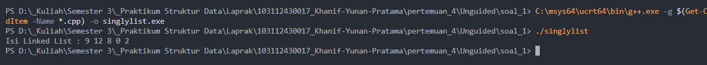
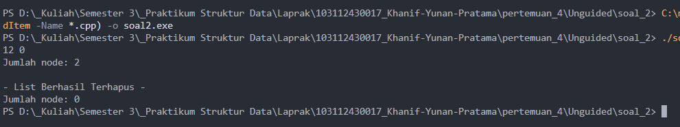

# <h1 align="center">Laporan Praktikum Modul 4 - SINGLY LINKED LIST (BAGIAN PERTAМА)</h1>
<p align="center">Khanif Yunan Pratama - 103112430017</p>

## Dasar Teori
Struktur data Linked List memiliki peran penting dalam meningkatkan efisiensi pengolahan data, khususnya pada sistem antrian [1]. Linked List merupakan struktur data dinamis yang terdiri dari simpul-simpul (node) saling terhubung, di mana setiap node berisi data dan pointer ke node berikutnya [1]. Keunggulan utama Linked List adalah fleksibilitasnya dalam menambah atau menghapus elemen tanpa harus memindahkan seluruh data seperti pada Array. Namun, kelemahannya terletak pada waktu akses yang relatif lebih lama karena harus menelusuri setiap simpul secara berurutan [1].

Selain itu, penerapan struktur data Linked List juga dapat digunakan untuk mengatasi permasalahan pada database relasional yang tidak normal, terutama ketika terdapat banyak kolom kosong atau hubungan antar data yang kompleks [2]. Dengan menggunakan pointer dan Linked List, setiap data dapat dihubungkan secara langsung tanpa memerlukan kolom tambahan, sehingga penggunaan memori menjadi lebih efisien [2]. Struktur ini memungkinkan pengelolaan data yang dinamis, di mana penambahan dan penghapusan elemen dapat dilakukan dengan cepat tanpa harus memindahkan seluruh isi tabel [2]. Pendekatan ini menjadikan Linked List sebagai alternatif efektif dalam menjaga efisiensi dan fleksibilitas sistem penyimpanan data modern [2].
## Guided 

### 1. Guided 1
##### a. list.cpp
```C++
#include "list.h"
#include <iostream>
using namespace std;

//I.S = Initial State / kondisi awal
//F.S = Final State / kondisi akhir

//fungsi untuk cek apakah list kosong atau tidak
bool isEmpty(linkedlist List) {
    if(List.first == Nil){
        return true; 
    } else {
        return false;
    }
}

//pembuatan linked list kosong
void createList(linkedlist &List) {
    /* I.S. sembarang
       F.S. terbentuk list kosong */
    List.first = Nil;
}

//pembuatan node baru dengan menerapkan manajemen memori
address alokasi(string nama, string nim, int umur) { 
    /* I.S. sembarang
       F.S. mengembalikan alamat node baru dengan isidata = sesuai parameter dan next = Nil */
    address nodeBaru = new node; 
    nodeBaru->isidata.nama = nama;
    nodeBaru->isidata.nim = nim; 
    nodeBaru->isidata.umur = umur;
    nodeBaru->next = Nil;
    return nodeBaru;
}

//penghapusan node dengan menerapkan manajemen memori
void dealokasi(address &node) {
    /* I.S. P terdefinisi
       F.S. memori yang digunakan node dikembalikan ke sistem */
    node->next = Nil;
    delete node;
}

//prosedur-prosedur untuk insert / menambahkan node baru kedalam list
void insertFirst(linkedlist &List, address nodeBaru) {
    /* I.S. sembarang, P sudah dialokasikan
       F.S. menempatkan elemen list (node) pada awal list */
    nodeBaru->next = List.first; 
    List.first = nodeBaru;
}

void insertAfter(linkedlist &List, address nodeBaru, address Prev) {
    /* I.S. sembarang, nodeBaru dan Prev alamat salah satu elemen list (node)
       F.S. menempatkan elemen (node) sesudah elemen node Prev */
    if (Prev != Nil) {
        nodeBaru->next = Prev->next;
        Prev->next = nodeBaru;
    } else {
        cout << "Node sebelumnya tidak valid!" << endl;
    }
}

void insertLast(linkedlist &List, address nodeBaru) {
    /* I.S. sembarang, nodeBaru sudah dialokasikan
       F.S. menempatkan elemen nodeBaru pada akhir list */
    if (isEmpty(List) == true) {
        List.first = nodeBaru;
    } else {
        address nodeBantu = List.first;
        while (nodeBantu->next != Nil) {
            nodeBantu = nodeBantu->next;
        }
        nodeBantu->next = nodeBaru;
    }
}

//prosedur untuk menampilkan isi list
void printList(linkedlist List) {
    /* I.S. list mungkin kosong
       F.S. jika list tidak kosong menampilkan semua info yang ada pada list */
    if (isEmpty(List) == true) {
        cout << "List kosong." << endl;
    } else {
        address nodeBantu = List.first;
        while (nodeBantu != Nil) { 
            cout << "Nama : " << nodeBantu->isidata.nama << ", NIM : " << nodeBantu->isidata.nim 
            << ", Usia : " << nodeBantu->isidata.umur << endl;
            nodeBantu = nodeBantu->next;
        }
    }
}
```
Program list.cpp ini adalah bagian dari program linked list yang berisi implementasi dari semua fungsi yang dideklarasikan di list.h. Program ini menangani pembuatan linked list kosong, penempatan node, penambahan node di awal, tengah, atau akhir list, serta menampilkan isi list. Dengan kata lain, list.cpp menjalankan logika utama dari linked list mahasiswa.

##### b. list.h
```C++
//Header guard digunakan untuk mencegah file header yang sama 
//di-include lebih dari sekali dalam satu program.
#ifndef LIST_H
#define LIST_H
#define Nil NULL

#include<iostream>
using namespace std;

//deklarasi isi data struct mahasiswa
struct mahasiswa{
    string nama; 
    string nim;
    int umur;
};

typedef mahasiswa dataMahasiswa; //Memberikan nama alias dataMahasiswa untuk struct mahasiswa.

typedef struct node *address; //Mendefinisikan alias address sebagai pointer ke struct node

struct node{ // node untuk isi dari linked listnya, isi setiap node adalah data & pointer next
    dataMahasiswa isidata;
    address next;
};

struct linkedlist{ //ini linked list nya
    address first;
};

//semua function & prosedur yang akan dipakai
bool isEmpty(linkedlist List);
void createList(linkedlist &List);
address alokasi(string nama, string nim, int umur);
void dealokasi(address &node);
void printList(linkedlist List);
void insertFirst(linkedlist &List, address nodeBaru);
void insertAfter(linkedlist &List, address nodeBaru, address Prev);
void insertLast(linkedlist &List, address nodeBaru);

#endif
```
Program list.h ini adalah salah satu bagian dari program linked list. Nah, list.h digunakan untuk mendeklarasikan tipe data bentukan, yaitu mahasiswa yang isinya nama, NIM, dan umur. Selain itu, list.h juga mendeklarasikan struktur node dan linked list, serta semua prototipe fungsi yang akan digunakan untuk membuat, menambah, dan menampilkan isi list.

##### c. main.cpp
```C++
#include "list.h"

#include<iostream>
using namespace std;

int main(){
    linkedlist List;
    address nodeA, nodeB, nodeC, nodeD, nodeE = Nil;
    createList(List);

    dataMahasiswa mhs;

    nodeA = alokasi("Dhimas", "2311102151", 20);
    nodeB = alokasi("Arvin", "2211110014", 21);
    nodeC = alokasi("Rizal", "2311110029", 20);
    nodeD = alokasi("Satrio", "2211102173", 21);
    nodeE = alokasi("Joshua", "2311102133", 21);

    insertFirst(List, nodeA);
    insertLast(List, nodeB);
    insertAfter(List, nodeC, nodeA);
    insertAfter(List, nodeD, nodeC);
    insertLast(List, nodeE);

    cout << "--- ISI LIST SETELAH DILAKUKAN INSERT ---" << endl;
    printList(List);

    return 0;
}
```
Program main.cpp ini adalah bagian dari program linked list yang digunakan untuk menguji semua fungsi yang ada di list.h dan list.cpp. Program ini membuat list kosong, membuat beberapa node mahasiswa, menambahkan node ke list dengan urutan tertentu, lalu menampilkan isi list sesuai urutan penambahan. Program ini membantu melihat apakah linked list berjalan sesuai yang diinginkan.

### 2. Guided 2
##### a. list.cpp
```C++
#include "list.h"
#include <iostream>
using namespace std;

//I.S = Initial State / kondisi awal
//F.S = Final State / kondisi akhir

//fungsi untuk cek apakah list kosong atau tidak
bool isEmpty(linkedlist List) {
    if(List.first == Nil){
        return true; 
    } else {
        return false;
    }
}

//pembuatan linked list kosong
void createList(linkedlist &List) {

    List.first = Nil;
}

//pembuatan node baru
address alokasi(string nama, string nim, int umur) { 

    address nodeBaru = new node; 
    nodeBaru->isidata.nama = nama;
    nodeBaru->isidata.nim = nim; 
    nodeBaru->isidata.umur = umur;
    nodeBaru->next = Nil;
    return nodeBaru;
}

//penghapusan node
void dealokasi(address &node) {
    node->next = Nil;
    delete node;
}

//prosedur-prosedur untuk insert / menambahkan node baru kedalam list
void insertFirst(linkedlist &List, address nodeBaru) {

    nodeBaru->next = List.first; 
    List.first = nodeBaru;
}

void insertAfter(linkedlist &List, address nodeBaru, address Prev) {

    if (Prev != Nil) { //Previous (sebelumnya) tidak boleh NULL
        nodeBaru->next = Prev->next;
        Prev->next = nodeBaru;
    } else {
        cout << "Node sebelumnya tidak valid!" << endl;
    }
}

void insertLast(linkedlist &List, address nodeBaru) {

    if (isEmpty(List)) {
        List.first = nodeBaru;
    } else {
        address nodeBantu = List.first;
        while (nodeBantu->next != Nil) {
            nodeBantu = nodeBantu->next;
        }
        nodeBantu->next = nodeBaru;
    }
}

//prosedur-prosedur untuk delete / menghapus node yang ada didalam list
void delFirst(linkedlist &List){

    address nodeHapus;
    if (isEmpty(List) == false) {
        nodeHapus = List.first;
        List.first = List.first->next;
        nodeHapus->next = Nil;
        dealokasi(nodeHapus);
    } else {
        cout << "List kosong!" << endl;
    }
}

void delLast(linkedlist &List){

    address nodeHapus, nodePrev;
    if(isEmpty(List) == false){
        nodeHapus = List.first;
        if(nodeHapus->next == Nil){
            List.first->next = Nil;
            dealokasi(nodeHapus);
        } else { 
            while(nodeHapus->next != Nil){
                nodePrev = nodeHapus; 
                nodeHapus = nodeHapus->next;
            }
            nodePrev->next = Nil; 
            dealokasi(nodeHapus);
        }
    } else {
        cout << "list kosong" << endl;
    }
}

void delAfter(linkedlist &List, address nodeHapus, address nodePrev){

    if(isEmpty(List) == true){
        cout << "List kosong!" << endl;
    } else { //jika list tidak kosong
        if (nodePrev != Nil && nodePrev->next != Nil) { 
            nodeHapus = nodePrev->next;       
            nodePrev->next = nodeHapus->next;  
            nodeHapus->next = Nil;         
            dealokasi(nodeHapus);
        } else {
            cout << "Node sebelumnya (prev) tidak valid!" << endl;
        }
    }
}

//prosedur untuk menampilkan isi list
void printList(linkedlist List) {

    if (isEmpty(List)) {
        cout << "List kosong." << endl;
    } else {
        address nodeBantu = List.first;
        while (nodeBantu != Nil) { 
            cout << "Nama : " << nodeBantu->isidata.nama << ", NIM : " << nodeBantu->isidata.nim << ", Usia : " << nodeBantu->isidata.umur << endl;
            nodeBantu = nodeBantu->next;
        }
    }
}

//function untuk menampilkan jumlah node didalam list
int nbList(linkedlist List) {

    int count = 0;
    address nodeBantu = List.first;
    while (nodeBantu != Nil) {
        count++;
        nodeBantu = nodeBantu->next; 
    }
    return count;
}

//prosedur untuk menghapus list (menghapus semua node didalam list)
void deleteList(linkedlist &List){

    address nodeBantu, nodeHapus;
    nodeBantu = List.first;
    while(nodeBantu != Nil){
        nodeHapus = nodeBantu;
        nodeBantu = nodeBantu->next;
        dealokasi(nodeHapus); 
    }
    List.first = Nil; 
    cout << "List sudah terhapus!" << endl;
}
```
Program list.cpp ini merupakan bagian utama yang berisi implementasi seluruh fungsi dari list.h. Program ini mengatur proses pembuatan list kosong, penambahan node baru ke awal, tengah, atau akhir list, serta penghapusan node dari berbagai posisi. Selain itu, terdapat fungsi untuk mengecek apakah list kosong, menghitung jumlah node, menampilkan isi list, dan menghapus seluruh data di dalam list. Secara singkat, list.cpp berperan sebagai pengelola utama yang menangani semua operasi pada struktur data linked list mahasiswa.

##### b. list.h
```C++
//Header guard digunakan untuk mencegah file header yang sama
//di-include lebih dari sekali dalam satu program.
#ifndef LIST_H
#define LIST_H
#define Nil NULL

#include <iostream>
using namespace std;

//deklarasi isi data struct mahasiswa
struct mahasiswa{
    string nama; 
    string nim;
    int umur;
};

typedef mahasiswa dataMahasiswa; //Memberikan nama alias dataMahasiswa untuk struct mahasiswa.

typedef struct node *address; //Mendefinisikan alias address sebagai pointer ke struct node

struct node{ // node untuk isi dari linked listnya, isi setiap node adalah data & pointer next
    dataMahasiswa isidata;
    address next;
};

struct linkedlist{ //ini linked list nya
    address first;
};

//semua function & prosedur yang akan dipakai
bool isEmpty(linkedlist List);
void createList(linkedlist &List);
address alokasi(string nama, string nim, int umur);
void dealokasi(address &node);
void printList(linkedlist List);
void insertFirst(linkedlist &List, address nodeBaru);
void insertAfter(linkedlist &List, address nodeBaru, address Prev);
void insertLast(linkedlist &List, address nodeBaru);

void delFirst(linkedlist &List);
void delLast(linkedlist &List);
void delAfter(linkedlist &List, address nodeHapus, address nodePrev);
int nbList(linkedlist List);
void deleteList(linkedlist &List);

#endif
```
Program list.h ini merupakan bagian dari keseluruhan program linked list mahasiswa. Program ini digunakan untuk mendeklarasikan tipe data bentukan, yaitu mahasiswa yang berisi nama, NIM, dan umur. Selain itu, list.h juga mendefinisikan struktur node yang berisi data mahasiswa dan pointer next, serta struktur linkedlist yang berfungsi menyimpan alamat node pertama dari list. Di dalamnya juga terdapat deklarasi fungsi-fungsi penting seperti membuat list, menambah node, menghapus node, menghitung jumlah node, dan menampilkan isi list.

##### c. main.cpp
```C++
#include "list.h"

#include<iostream>
using namespace std;

int main(){
    linkedlist List;
    address nodeA, nodeB, nodeC, nodeD, nodeE = Nil;
    createList(List);

    dataMahasiswa mhs;

    nodeA = alokasi("Dhimas", "2311102151", 20);
    nodeB = alokasi("Arvin", "2211110014", 21);
    nodeC = alokasi("Rizal", "2311110029", 20);
    nodeD = alokasi("Satrio", "2211102173", 21);
    nodeE = alokasi("Joshua", "2311102133", 21);

    insertFirst(List, nodeA);
    insertLast(List, nodeB);
    insertAfter(List, nodeC, nodeA);
    insertAfter(List, nodeD, nodeC);
    insertLast(List, nodeE);

    cout << "ISI LIST SETELAH DILAKUKAN INSERT" << endl;
    printList(List);
    cout << "jumlah node : " << nbList(List) << endl;
    cout << endl;

    delFirst(List);
    delLast(List);
    delAfter(List, nodeD, nodeC);

    cout << "ISI LIST SETELAH DILAKUKAN DELETE" << endl;
    printList(List);
    cout << "jumlah node : " << nbList(List) << endl;
    cout << endl;

    deleteList(List);
    cout << "ISI LIST SETELAH DILAKUKAN HAPUS LIST" << endl;
    printList(List);
    cout << "jumlah node : " << nbList(List) << endl;
    cout << endl;

    return 0;
}
```
Program main.cpp ini berfungsi sebagai program utama yang menjalankan dan menguji semua fungsi yang telah dibuat di list.h dan list.cpp. Program diawali dengan membuat list kosong, kemudian membuat lima node mahasiswa (Dhimas, Arvin, Rizal, Satrio, dan Joshua) menggunakan fungsi alokasi(). Setelah itu, node-node tersebut dimasukkan ke dalam list menggunakan kombinasi insertFirst(), insertAfter(), dan insertLast() sehingga terbentuk urutan data tertentu.

Selanjutnya, program menampilkan isi list dan jumlah node menggunakan printList() dan nbList(). Lalu dilakukan penghapusan node menggunakan delFirst(), delLast(), dan delAfter() untuk melihat perubahan isi list. Terakhir, seluruh list dihapus dengan deleteList() sehingga tidak ada lagi node yang tersisa.

## Unguided 

### 1. Soal 1

Singlylist.h
```C++
#ifndef SINGLYLIST_H
#define SINGLYLIST_H

#include <iostream>
using namespace std;

struct Node {
    int info;
    Node* next;
};

struct LinkedList {
    Node* first;
};

void createList(LinkedList &L);
bool isEmpty(LinkedList L);
Node* alokasi(int x);
void insertFirst(LinkedList &L, Node* P);
void insertAfter(Node* Prec, Node* P);
void insertLast(LinkedList &L, Node* P);
void printList(LinkedList L);

#endif
```

Singlylist.cpp
```C++
#include "Singlylist.h"

void createList(LinkedList &L) {
    L.first = nullptr;
}

bool isEmpty(LinkedList L) {
    return (L.first == nullptr);
}

Node* alokasi(int x) {
    Node* P = new Node;
    P->info = x;
    P->next = nullptr;
    return P;
}

void insertFirst(LinkedList &L, Node* P) {
    P->next = L.first;
    L.first = P;
}

void insertAfter(Node* Prec, Node* P) {
    if (Prec != nullptr) {
        P->next = Prec->next;
        Prec->next = P;
    }
}

void insertLast(LinkedList &L, Node* P) {
    P->next = nullptr;
    if (isEmpty(L)) {
        L.first = P;
    } else {
        Node* Q = L.first;
        while (Q->next != nullptr) {
            Q = Q->next;
        }
        Q->next = P;
    }
}

void printList(LinkedList L) {
    if (isEmpty(L)) {
        cout << "List kosong." << endl;
    } else {
        Node* P = L.first;
        while (P != nullptr) {
            cout << P->info;
            if (P->next != nullptr) cout << " ";
            P = P->next;
        }
        cout << endl;
    }
}
```

main.cpp
```C++
#include "Singlylist.h"
#include <iostream>
using namespace std;

int main() {
    LinkedList L;
    createList(L);

    Node *P1, *P2, *P3, *P4, *P5;
    P1 = alokasi(9);
    P2 = alokasi(8);
    P3 = alokasi(2);
    P4 = alokasi(12);
    P5 = alokasi(0);

    insertFirst(L, P1);     
    insertAfter(P1, P2);    
    insertAfter(P1, P4);    
    insertLast(L, P5);      
    insertLast(L, P3);      

    cout << "Isi Linked List : ";
    printList(L);

    return 0;
}
```
### Output Soal 1 :

Program ini menggunakan linked list untuk menyimpan data secara dinamis. Setiap elemen disimpan dalam node yang saling terhubung menggunakan pointer. Melalui proses penyisipan di awal dan akhir daftar, terbentuk urutan nilai 9, 12, 8, 0, dan 2. Kemudian, program menelusuri setiap node dan menampilkan seluruh isi daftar, sehingga menggambarkan cara kerja dasar linked list dalam penyimpanan dan penampilan data.
### 2. Soal 2

Singlylist.h
```C++
#ifndef SINGLYLIST_H
#define SINGLYLIST_H

#include <iostream>
using namespace std;

struct Node {
    int info;
    Node* next;
};

struct LinkedList {
    Node* first;
};

void createList(LinkedList &L);
bool isEmpty(LinkedList L);
Node* alokasi(int x);
void insertFirst(LinkedList &L, Node* P);
void insertAfter(Node* Prec, Node* P);
void insertLast(LinkedList &L, Node* P);
void deleteFirst(LinkedList &L);
void deleteLast(LinkedList &L);
void deleteAfter(Node* Prec);
int nbList(LinkedList L);
void deleteList(LinkedList &L);
void printList(LinkedList L);

#endif
```

Singlylist.cpp
```C++
#include "Singlylist.h"

void createList(LinkedList &L) {
    L.first = nullptr;
}

bool isEmpty(LinkedList L) {
    return (L.first == nullptr);
}

Node* alokasi(int x) {
    Node* P = new Node;
    P->info = x;
    P->next = nullptr;
    return P;
}

void insertFirst(LinkedList &L, Node* P) {
    P->next = L.first;
    L.first = P;
}

void insertAfter(Node* Prec, Node* P) {
    if (Prec != nullptr) {
        P->next = Prec->next;
        Prec->next = P;
    }
}

void insertLast(LinkedList &L, Node* P) {
    P->next = nullptr;
    if (isEmpty(L)) {
        L.first = P;
    } else {
        Node* Q = L.first;
        while (Q->next != nullptr) {
            Q = Q->next;
        }
        Q->next = P;
    }
}

void deleteFirst(LinkedList &L) {
    if (!isEmpty(L)) {
        Node* P = L.first;
        L.first = P->next;
        delete P;
    }
}

void deleteLast(LinkedList &L) {
    if (!isEmpty(L)) {
        if (L.first->next == nullptr) {
            delete L.first;
            L.first = nullptr;
        } else {
            Node* Q = L.first;
            Node* Prev = nullptr;
            while (Q->next != nullptr) {
                Prev = Q;
                Q = Q->next;
            }
            Prev->next = nullptr;
            delete Q;
        }
    }
}

void deleteAfter(Node* Prec) {
    if (Prec != nullptr && Prec->next != nullptr) {
        Node* P = Prec->next;
        Prec->next = P->next;
        delete P;
    }
}

int nbList(LinkedList L) {
    int count = 0;
    Node* P = L.first;
    while (P != nullptr) {
        count++;
        P = P->next;
    }
    return count;
}

void deleteList(LinkedList &L) {
    while (!isEmpty(L)) {
        deleteFirst(L);
    }
}

void printList(LinkedList L) {
    if (isEmpty(L)) {
        cout << "List kosong." << endl;
    } else {
        Node* P = L.first;
        while (P != nullptr) {
            cout << P->info;
            if (P->next != nullptr) cout << " ";
            P = P->next;
        }
        cout << endl;
    }
}
```

main.cpp
```C++
#include "Singlylist.h"
#include <iostream>
using namespace std;

int main() {
    LinkedList L;
    createList(L);

    Node *P1, *P2, *P3, *P4, *P5;
    P1 = alokasi(9);
    P2 = alokasi(8);
    P3 = alokasi(2);
    P4 = alokasi(12);
    P5 = alokasi(0);

    insertFirst(L, P1);
    insertAfter(P1, P2);
    insertAfter(P1, P4);
    insertLast(L, P5);
    insertLast(L, P3);

    deleteFirst(L);
    deleteLast(L);
    deleteAfter(P4);

    printList(L);
    cout << "Jumlah node: " << nbList(L) << endl << endl;

    deleteList(L);
    cout << "- List Berhasil Terhapus -" << endl;
    cout << "Jumlah node: " << nbList(L) << endl;

    return 0;
}```
### Output Soal 2:

Program ini mengimplementasikan struktur data linked list untuk melakukan operasi penyisipan dan penghapusan data secara dinamis. Program membuat lima node dengan nilai 9, 8, 2, 12, dan 0, kemudian menyusunnya menggunakan fungsi insertFirst, insertAfter, dan insertLast. Setelah itu, dilakukan penghapusan node 9 menggunakan deleteFirst, node 2 menggunakan deleteLast, dan node 8 menggunakan deleteAfter, sehingga tersisa node bernilai 12 dan 0. Program menampilkan jumlah node menggunakan nbList, lalu menghapus seluruh node dengan deleteList hingga list kosong.
## Kesimpulan
Kesimpulannya, dari kedua soal tersebut dapat dipahami bahwa linked list merupakan struktur data dinamis yang memungkinkan penambahan dan penghapusan elemen dengan mudah tanpa perlu memindahkan data lain. Melalui fungsi seperti insert dan delete, kita dapat mengelola data secara efisien dibandingkan struktur statis seperti array, terutama saat jumlah data sering berubah.
## Referensi
<br>[1] Wijoyo, Agung., Prasetiyo, Alif Ramdhani., Salsabila, Afra Anggita., Nife, Kristina., Murni., & Nadapdap, Pandri Budiman. (2024). _Evaluasi Efisiensi Struktur Data Linked List pada Implementasi Sistem Antrian._ JRIIN: Jurnal Riset Informatika dan Inovasi, 1(12), 1244-1246. Diakses pada 18 Oktober 2025 melalui [https://jurnalmahasiswa.com/index.php/jriin/article/view/1060/678](https://jurnalmahasiswa.com/index.php/jriin/article/view/1060/678)
<br>[2] Banjarnahor, J. (2022). _Pemanfaatan Link List Untuk Mengatasi Database Tidak Normal._ **Lofian: Jurnal Ilmu Komputer dan Informatika**, 2(1), 16–23. Diakses pada 18 Oktober 2025 melalui [https://ejournal.umbp.ac.id/index.php/lofian/article/download/183/152/448](https://ejournal.umbp.ac.id/index.php/lofian/article/download/183/152/448?utm_source=chatgpt.com)
