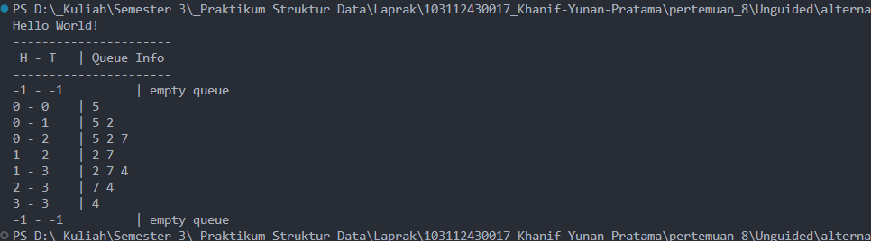

# <h1 align="center">Laporan Praktikum Modul 8 -Queue</h1>
<p align="center">Khanif Yunan Pratama - 103112430017</p>

## Dasar Teori
Queue atau antrian merupakan bentuk struktur data linear yang bekerja dengan prinsip FIFO (_First In, First Out_), yaitu elemen yang masuk terlebih dahulu akan diproses atau dikeluarkan lebih dulu. Mekanisme ini menggambarkan berbagai situasi dalam kehidupan sehari-hari, seperti antrian di loket layanan, proses pencetakan pada printer, hingga pengiriman data pada jaringan komputer[1]

Salah satu aspek penting dalam sistem antrian adalah penggunaan struktur data yang sesuai. Struktur queue dengan konsep First In, First Out (FIFO) dipandang sebagai metode yang paling tepat untuk menjaga keadilan dan keteraturan proses pelayanan. Melalui prinsip ini, elemen atau dokumen yang datang terlebih dahulu akan diproses lebih dulu. Untuk meningkatkan fleksibilitas pengelolaan data, penggunaan linked list menjadi solusi yang efisien karena dapat menyesuaikan jumlah antrian yang berubah-ubah tanpa perlu menetapkan kapasitas awal seperti pada array[2].

## Guided 
### 1. Guided 1
##### queue.cpp
```C++
#include "queue.h"
#include <iostream> 

using namespace std;

int main() {
    queue Q;
    address nodeA, nodeB, nodeC, nodeD, nodeE = Nil;
    createQueue(Q);

    nodeA = alokasi(1);
    nodeB = alokasi(2);
    nodeC = alokasi(3);
    nodeD = alokasi(4);
    nodeE = alokasi(5);
    
    enQueue(Q, nodeA);
    enQueue(Q, nodeB);
    enQueue(Q, nodeC);
    enQueue(Q, nodeD);
    enQueue(Q, nodeE);
    cout << endl;

    cout << "--- Queue setelah enqueue ---" << endl;
    viewQueue(Q);
    cout << endl;

    deQueue(Q);
    deQueue(Q);
    cout << endl;

    cout << "--- Queue setelah dequeue 2 kali ---" << endl;
    viewQueue(Q);
    cout << endl;

    updateQueue(Q, 2);
    updateQueue(Q, 1);
    updateQueue(Q, 4);
    cout << endl;

    cout << "--- Queue setelah update ---" << endl;
    viewQueue(Q);
    cout << endl;

    searchData(Q, 4);
    searchData(Q, 9);
    cout << endl;

    return 0;
}
```
##### queue.h
```c++
#ifndef QUEUE_H
#define QUEUE_H
#define Nil NULL

#include<iostream>
using namespace std;

typedef struct node *address;

struct node{
    int dataAngka;
    address next;
};

struct queue{
    address head;
    address tail;
};

bool isEmpty(queue Q);
void createQueue(queue &Q);
address alokasi(int angka);
void dealokasi(queue &node);

void enQueue(queue &Q, address nodeBaru);
void deQueue(queue &Q);
void updateQueue(queue &Q, int posisi);
void viewQueue(queue Q);
void searchData(queue Q, int angka);

#endif
```
##### main.cpp
```c++
#include "queue.h"
#include <iostream> 

using namespace std;

int main() {
    queue Q;
    address nodeA, nodeB, nodeC, nodeD, nodeE = Nil;
    createQueue(Q);

    nodeA = alokasi(1);
    nodeB = alokasi(2);
    nodeC = alokasi(3);
    nodeD = alokasi(4);
    nodeE = alokasi(5);
    
    enQueue(Q, nodeA);
    enQueue(Q, nodeB);
    enQueue(Q, nodeC);
    enQueue(Q, nodeD);
    enQueue(Q, nodeE);
    cout << endl;

    cout << "--- Queue setelah enqueue ---" << endl;
    viewQueue(Q);
    cout << endl;

    deQueue(Q);
    deQueue(Q);
    cout << endl;

    cout << "--- Queue setelah dequeue 2 kali ---" << endl;
    viewQueue(Q);
    cout << endl;

    updateQueue(Q, 2);
    updateQueue(Q, 1);
    updateQueue(Q, 4);
    cout << endl;

    cout << "--- Queue setelah update ---" << endl;
    viewQueue(Q);
    cout << endl;

    searchData(Q, 4);
    searchData(Q, 9);
    cout << endl;

    return 0;
}
```
Program ini mengimplementasikan Queue berbasis Linked List, di mana setiap elemen antrean disimpan sebagai node yang saling terhubung menggunakan pointer next, sehingga antrean dapat tumbuh secara fleksibel tanpa batasan kapasitas tetap seperti pada array. Dalam fungsi main, program mendemonstrasikan siklus lengkap pengelolaan antrean: dimulai dari alokasi memori untuk pembentukan node baru, penambahan data ke posisi belakang enqueue, penghapusan elemen dari posisi depan dequeue, hingga operasi manipulasi data seperti pembaruan nilai (update) dan pencarian (search) pada elemen yang tersisa dalam rantai antrean.

### 2. Guided 2
##### queue.cpp
```C++
#include "queue.h" 
#include <iostream>

using namespace std;

void createQueue(Queue &Q) {
    Q.head = 0; 
    Q.tail = 0; 
    Q.count = 0;
}

bool isEmpty(Queue Q) {
    return Q.count == 0; //Kembalikan true jika jumlah elemen adalah 0
}

bool isFull(Queue Q) {
    return Q.count == MAX_QUEUE; // Kembalikan true jika jumlah elemen sama dengan maks
}

// Definisi prosedur untuk menambahkan elemen (enqueue)
void enqueue(Queue &Q, int x) {
    if (!isFull(Q)) { 
        Q.info[Q.tail] = x; // Masukkan data (x) ke posisi ekor (tail)
        // Pindahkan ekor secara circular (memutar)
        Q.tail = (Q.tail + 1) % MAX_QUEUE; 
        Q.count++; //Tambah jumlah elemen
    } else { 
        cout << "Antrean Penuh!" << endl;
    }
}

//Definisi fungsi untuk menghapus elemen (dequeue)
int dequeue(Queue &Q) {
    if (!isEmpty(Q)) { 
        int x = Q.info[Q.head]; // Ambil data di posisi  (head)
        Q.head = (Q.head + 1) % MAX_QUEUE;
        Q.count--; // Kurangi jumlah elemen
        return x;
    } else {
        cout << "Antrean Kosong!" << endl;
        return -1;
    }
}

// Definisi prosedur untuk menampilkan isi queue 
void printInfo(Queue Q) {
    cout << "Isi Queue: [ ";
    if (!isEmpty(Q)) { 
        int i = Q.head; // Mulai dari head
        int n = 0; //Penghitung elemen yang sudah dicetak
        while (n < Q.count) { // Ulangi sebanyak jumlah elemen
            cout << Q.info[i] << " "; // Cetak info
            i = (i + 1) % MAX_QUEUE; // Geser i secara circular
            n++; // Tambah penghitung
        }
    }
    cout << "]" << endl;
}
```

##### queue.h
```c++
#ifndef QUEUE_H
#define QUEUE_H

#define MAX_QUEUE 5

struct Queue {
    int info [MAX_QUEUE];
    int head;
    int tail;
    int count;
};

void createQueue(Queue &Q);
bool isEmpty(Queue Q);
bool isFull(Queue Q);
void enqueue(Queue &Q, int x);
int dequeue(Queue &Q);
void printInfo(Queue Q);
#endif
```

##### main.cpp
```c++
#include <iostream>
#include "queue.h"

using namespace std;

int main(){
    Queue Q;
    createQueue(Q);
    printInfo(Q);

    cout << "\n Enqueue 3 elemen" << endl;
    enqueue(Q, 5);
    printInfo(Q);
    enqueue(Q, 2);
    printInfo(Q);
    enqueue(Q, 7);
    printInfo(Q);
    cout << "\n Dequeue 1 elemen" <<  endl;
    cout << "Elemen keluar: " << dequeue(Q) << endl;
    printInfo(Q);

    cout << "\n Enqueue 2 elemen" << endl;
    cout << "Elemen keluar: " << dequeue(Q) << endl;
    cout << "Elemen keluar: " << dequeue(Q) << endl;
    printInfo(Q);

    return 0;
}
```
Program ini mengimplementasikan struktur data queue (antrian) menggunakan array dengan konsep circular queue, di mana elemen baru ditambahkan melalui operasi enqueue dan elemen dihapus melalui dequeue. Variabel head, tail, dan count digunakan untuk melacak posisi awal, akhir, dan jumlah elemen dalam antrian. Fungsi isEmpty dan isFull memastikan antrian tidak kosong atau penuh sebelum melakukan operasi. Saat enqueue, data dimasukkan ke posisi tail lalu penunjuknya digeser memutar menggunakan operasi modulo, sementara saat dequeue, data diambil dari head dan penunjuknya juga digeser memutar. Program utama mendemonstrasikan proses menambah dan menghapus elemen, kemudian menampilkan isi antrian menggunakan fungsi printInfo.
## Unguided 

## 1. Alternatif 1
queue.h
```c++
#ifndef QUEUE_H
#define QUEUE_H

#define MAX_QUEUE 5

typedef int infotype;

struct Queue {
    infotype info[MAX_QUEUE];
    int head;
    int tail;
};

void createQueue(Queue &Q);
bool isEmptyQueue(Queue Q);
bool isFullQueue(Queue Q);
void enqueue(Queue &Q, infotype x);
infotype dequeue(Queue &Q);
void printInfo(Queue Q);

#endif
```

queue.cpp
```c++
#include "queue.h"
#include <iostream>
using namespace std;


void createQueue(Queue &Q) {
    Q.head = -1;
    Q.tail = -1;
}

bool isEmptyQueue(Queue Q) {
    return Q.head == -1 && Q.tail == -1;
}

bool isFullQueue(Queue Q) {
    return Q.tail == MAX_QUEUE - 1;
}

void enqueue(Queue &Q, infotype x) {
    if (isFullQueue(Q)) {
        cout << "Queue penuh!" << endl;
        return;
    }

    if (isEmptyQueue(Q)) {
        Q.head = 0;
        Q.tail = 0;
    } else {
        Q.tail++;
    }

    Q.info[Q.tail] = x;
}

infotype dequeue(Queue &Q) {
    if (isEmptyQueue(Q)) {
        cout << "Queue kosong!" << endl;
        return -1;
    }

    infotype x = Q.info[Q.head];
    
    if (Q.head == Q.tail) {
        Q.head = -1;
        Q.tail = -1;
    } else {
        for (int i = Q.head; i < Q.tail; i++) {
            Q.info[i] = Q.info[i + 1];
        }
        Q.tail--;
    }

    return x;
}

void printInfo(Queue Q) {
    cout << Q.head << " - " << Q.tail << " \t | ";

    if (isEmptyQueue(Q)) {
        cout << "empty queue" << endl;
        return;
    }

    for (int i = Q.head; i <= Q.tail; i++) {
        cout << Q.info[i] << " ";
    }
    cout << endl;
}
```

main.cpp
```C++
#include <iostream>
#include "queue.h"

using namespace std;

int main() {
    cout << "Hello World!" << endl;

    Queue Q;
    createQueue(Q);

    cout << "----------------------" << endl;
    cout << " H - T \t | Queue Info" << endl;
    cout << "----------------------" << endl;

    printInfo(Q);
    enqueue(Q, 5); printInfo(Q);
    enqueue(Q, 2); printInfo(Q);
    enqueue(Q, 7); printInfo(Q);
    dequeue(Q);   printInfo(Q);
    enqueue(Q, 4); printInfo(Q);
    dequeue(Q);   printInfo(Q);
    dequeue(Q);   printInfo(Q);
    dequeue(Q);   printInfo(Q);

    return 0;
}
```
Program ini merupakan implementasi Queue Alternatif 1, yang ditandai oleh pergeseran elemen array menggunakan perulangan di dalam fungsi dequeue setiap kali data diambil. Dalam pendekatan ini, indeks head secara efektif selalu dipertahankan di posisi awal karena setiap kali elemen terdepan dihapus, seluruh elemen yang berada di belakangnya wajib digeser maju satu langkah dan tail dimundurkan, yang membuat penggunaan memori efisien tanpa celah kosong namun mengorbankan kecepatan eksekusi untuk setiap operasi pengambilan data.
## 2. Alternatif 2
queue.cpp
```c++
#include "queue.h"
#include <iostream>
using namespace std;

void createQueue(Queue &Q) {
    Q.head = -1;
    Q.tail = -1;
}

bool isEmptyQueue(Queue Q) {
    return (Q.head == -1 && Q.tail == -1);
}

bool isFullQueue(Queue Q) {
    return (Q.tail == MAX_QUEUE - 1);
}

void enqueue(Queue &Q, infotype x) {
    if (isFullQueue(Q)) {
        cout << "Queue penuh!" << endl;
        return;
    }

    if (isEmptyQueue(Q)) {
        Q.head = 0;
        Q.tail = 0;
    } else {
        Q.tail++;
    }

    Q.info[Q.tail] = x;
}

infotype dequeue(Queue &Q) {
    if (isEmptyQueue(Q)) {
        cout << "Queue kosong!" << endl;
        return -1;
    }

    infotype x = Q.info[Q.head];

    if (Q.head == Q.tail) {
        Q.head = -1;
        Q.tail = -1;
    } else {
        Q.head++;
    }

    return x;
}

void printInfo(Queue Q) {
    cout << Q.head << " - " << Q.tail << " \t | ";

    if (isEmptyQueue(Q)) {
        cout << "empty queue" << endl;
        return;
    }

    for (int i = Q.head; i <= Q.tail; i++) {
        cout << Q.info[i] << " ";
    }
    cout << endl;
}
```
Program ini mengimplementasikan struktur data Queue Alternatif 2, di mana indeks head dan tail bergerak linier ke satu arah tanpa melakukan pergeseran elemen array saat proses dequeue. Pendekatan ini membuat operasi pengambilan data sangat cepat dan efisien karena hanya perlu menaikkan indeks head, namun memiliki kelemahan utama berupa fenomena "False Full", yaitu kondisi di mana antrean dianggap penuh saat tail mencapai ujung array meskipun slot memori di bagian depan sebenarnya sudah kosong akibat pengambilan data sebelumnya.
## 3. Alternatif 3
queue.cpp
```c++
#include "queue.h"
#include <iostream>
using namespace std;

void createQueue(Queue &Q) {
    Q.head = -1;
    Q.tail = -1;
}

bool isEmptyQueue(Queue Q) {
    return (Q.head == -1 && Q.tail == -1);
}

bool isFullQueue(Queue Q) {
    if (isEmptyQueue(Q)) return false;
    return ((Q.tail + 1) % MAX_QUEUE == Q.head);
}

void enqueue(Queue &Q, infotype x) {
    if (isFullQueue(Q)) {
        cout << "Queue penuh!" << endl;
        return;
    }

    if (isEmptyQueue(Q)) {
        Q.head = 0;
        Q.tail = 0;
    } else {
        Q.tail = (Q.tail + 1) % MAX_QUEUE;
    }

    Q.info[Q.tail] = x;
}

infotype dequeue(Queue &Q) {
    if (isEmptyQueue(Q)) {
        cout << "Queue kosong!" << endl;
        return -1; 
    }

    infotype x = Q.info[Q.head];

    if (Q.head == Q.tail) {
        Q.head = -1;
        Q.tail = -1;
    } else {
        Q.head = (Q.head + 1) % MAX_QUEUE;
    }

    return x;
}

void printInfo(Queue Q) {
    cout << Q.head << " - " << Q.tail << " \t | ";

    if (isEmptyQueue(Q)) {
        cout << "empty queue" << endl;
        return;
    }

    int i = Q.head;
    while (true) {
        cout << Q.info[i] << " ";
        if (i == Q.tail) break;
        i = (i + 1) % MAX_QUEUE; 
    }
    cout << endl;
}
```
Program ini merupakan implementasi Queue Alternatif 3, yaitu queue berbasis array circular yang memungkinkan antrean berputar sehingga ruang array dapat digunakan sepenuhnya tanpa perlu menggeser elemen saat dequeue. Struktur queue menggunakan indeks head dan tail yang akan bergerak secara melingkar dengan operasi modulo. Fungsi enqueue menambahkan data pada posisi tail dan memutarnya jika mencapai batas array, sedangkan dequeue menghapus data pada posisi head dengan cara yang sama. Kondisi penuh ditentukan ketika posisi tail yang sudah ditambah satu bertemu kembali dengan head, menunjukkan queue tidak dapat menampung data lagi. Fungsi printInfo menampilkan semua elemen queue dengan cara iterasi circular hingga mencapai posisi tail. Implementasi ini jauh lebih efisien daripada queue linear karena tidak melakukan shifting.
### Output 3 Program:

## Kesimpulan
Pada modul ini mengimplementasikan struktur data Queue dalam berbagai bentuk, yaitu queue berbasis linked list, queue berbasis array linear, serta queue berbasis array circular. Melalui guided dan unguided, mahasiswa memahami cara kerja operasi queue seperti enqueue, dequeue, update, search, dan penampilan data. Setiap pendekatan memiliki karakteristik tersendiri linked list memberikan fleksibilitas tanpa batas kapasitas, array linear mudah dipahami namun kurang efisien pada operasi dequeue, sedangkan array circular mampu memanfaatkan ruang dengan optimal tanpa perlu shifting elemen. Secara keseluruhan, praktikum ini membantu memperkuat pemahaman mengenai konsep FIFO (First In First Out), perbedaan implementasi struktur queue, serta bagaimana memilih metode yang paling sesuai dengan kebutuhan program.

## Referensi
[1] Trijayanti, Azura., Aulia, Intan., Khairunisa, Nazwa., Purba, Farhan Asyrof Hamadi., Gunawan, Indra. (2025). “Implementasi Struktur Data Antrian Queue dalam Sistem Penjadwalan Proses pada Sistem Operasi”. _Jurnal Publikasi Teknik Informatika_, 4(2). Diakses pada 19 November 2025 melalui
https://www.researchgate.net/publication/392920503_Implementasi_Struktur_Data_Antrian_Queue_dalam_Sistem_Penjadwalan_Proses_pada_Sistem_Operasi.
<br>[2] Sahida, Sirlia., Pasaribu, Farzad Sahnadi., Simanullang, Mika Monika Fransiska., Lubis, Muhammad Raihansyah. (2025). “Implementasi Queue Berbasis Linked List Pada Aplikasi Web Manajemen Antrian Print Mahasiswa”. _Jurnal Ilmu Komputer dan Informatika_, 2(2). Diakses pada 19 November 2025 melalui https://jurnal.globalscients.com/index.php/jiki/article/view/709/709